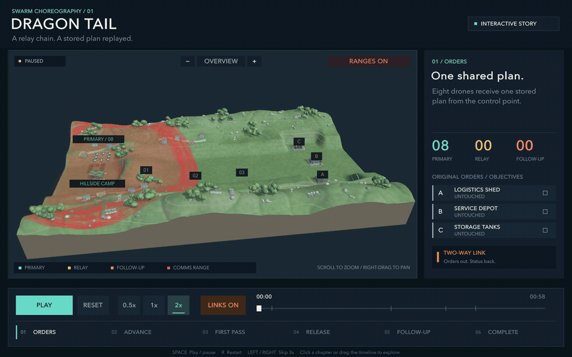
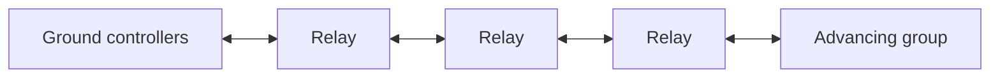

# Dragon Tail

**A visual exploration of an advancing drone group that leaves a temporary communications chain behind it.**

Dragon Tail proposes assigning a small part of a group to act as relays between the advancing units and their ground controllers. As the group moves onward, those relays form a “tail”: messages travel through successive links instead of relying on one direct connection across the entire distance.

This repository presents the idea as a **58-second interactive Unity visualization**, with an expanded terrain map, visible message flow, communication-range overlays, and a transition from relay duty to a second pass through the stored sequence.

## Watch the demo

[](https://github.com/Patwrick/Dragon-Tail/raw/refs/heads/main/docs/media/dragon-tail-demo-2x.mp4)

**[↓ Download the full-quality MP4](https://github.com/Patwrick/Dragon-Tail/raw/refs/heads/main/docs/media/dragon-tail-demo-2x.mp4)** · 2× speed · 1440 × 900 · 30 fps

The complete 58-second sequence plays in 29 seconds, with a brief opening and closing hold. The preview loops automatically. Download the MP4 for full-resolution playback.

## The idea

The motivation is to reduce reliance on long-range communications equipment on every unit by sharing the communications role across the group. Whether that would improve equipment cost or endurance is an open question; this project does not measure either.

The defining feature is the change of roles. Some units first support the advancing group as relays. After the initial pass, they leave their relay positions and reuse instructions they already hold.



## What the animation demonstrates

1. **A shared plan.** Eight units begin with a stored sequence.
2. **A growing tail.** Three units separate from the advancing group, rise, and circle their relay positions.
3. **Communication through the chain.** Bright orange lines and moving pulses illustrate messages traveling in both directions.
4. **A completed first pass.** The advancing group visits the three objective markers, A, B, and C.
5. **The tail changes roles.** The former relays depart and repeat the previously assigned A/B/C sequence.

The second pass uses the original stored instructions. It adds no new objectives and does not depend on fresh instructions after the chain is released. Its route and locations are fixed before playback.

## Reading the scene

| Visual | Meaning |
| --- | --- |
| Cyan units | Advancing primary group |
| Amber units and circular holds | Elevated relays |
| Coral units | Former relays performing the repeat pass |
| Bright orange links and pulses | Illustrated connections and message flow |
| Translucent red circles | Illustrative communication-range overlays for visible units |
| Terrain contours | The shape and elevation of the landscape |

The hillside camp, ridge crossing, and widely separated objective area make the distance between the controllers and advancing group easier to see. Zoom and pan to inspect the landscape, or hide the range overlays for a clearer view.

## Scope

Movement, relay placement, message pulses, range circles, and objective outcomes are authored animation cues. The circles use a fixed radius in arbitrary scene units. The visible links are drawn independently of those circles.

Radio propagation, terrain obstruction of signals, interference, latency, bandwidth, battery consumption, equipment costs, and aircraft dynamics are unmodeled. The presentation illustrates the concept and its assumptions; it provides no measured evidence of communications performance, protection, or practical feasibility. The source controls the visualization only and has no connection to flight hardware.

## Run the visualization

The project uses **Unity 6000.3.24f1 (Unity 6.3 LTS)**. The included build script produces a local Apple Silicon macOS application; build artifacts are generated locally.

From the repository root:

```sh
./scripts/build-mac.sh
open "Builds/Mac/Dragon Tail.app"
```

Alternatively, open [`DragonTailUnity`](DragonTailUnity) in the Unity Editor, open `Assets/Scenes/DragonTail.unity`, and enter Play mode.

The application starts paused. Click **PLAY** to begin.

| Control | Action |
| --- | --- |
| PLAY / PAUSE or Space | Start or pause the sequence |
| RESET or R | Return to the beginning |
| Timeline or chapter labels | Jump to a moment in the sequence |
| Left / Right arrows | Move backward or forward by three seconds |
| Speed buttons | Choose 0.5×, 1×, or 2× playback |
| LINKS / RANGES | Toggle the corresponding overlays |
| Mouse wheel or − / + | Zoom |
| Right or middle drag | Pan while zoomed in |
| OVERVIEW | Restore the full-map view |

## Repository guide

- [`docs/concept.md`](docs/concept.md) — concept notes and the authored sequence.
- [`docs/pseudocode.md`](docs/pseudocode.md) — illustrative state transitions and stored-order flow.
- [`docs/PLAY_ANIMATION.md`](docs/PLAY_ANIMATION.md) — detailed setup, controls, and verification guidance.
- [`docs/unity-animation-brief.md`](docs/unity-animation-brief.md) — visual storyboard and presentation choices.
- [`DragonTailUnity/Assets/Scripts`](DragonTailUnity/Assets/Scripts) — timeline, scene, models, overlays, and interface.
- [`scripts`](scripts) — local validation, build, and playback-review commands.

Run the timeline and project checks with `./scripts/check.sh`. After building, `./scripts/test-playback.sh` exercises playback and captures review frames in a graphical macOS session. Reports are written under `artifacts`; these checks assess the implementation of the visualization.
