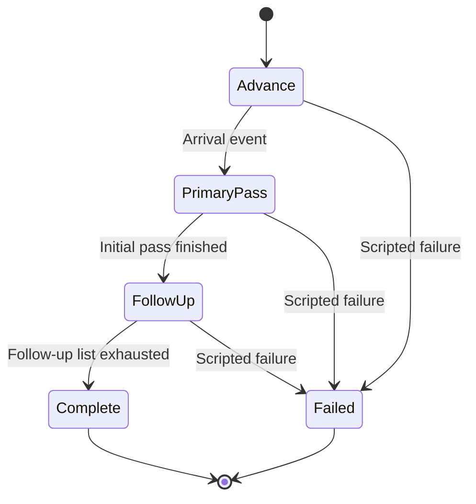

# Dragon Tail: concept record

Recorded September 13, 2026. The video-game concept and example algorithms are documented below. The subsequent Unity animation has now been requested and its source implemented; see [Play the animation](PLAY_ANIMATION.md) for setup and verification status.

## Original proposal

The game depicts a combat-zone drone swarm communicating with ground-team controllers. Its premise is that long-range communications equipment on every drone would be more expensive and consume more battery. Dragon Tail instead assigns a fraction of the swarm to maintain a chain of shorter communications links. This is the game's design premise; no real hardware savings are claimed.

As the swarm advances, drones stay behind one at a time. Each becomes a relay between the ground team and the advancing force, creating the “dragon tail.” Messages travel visually in both directions: instructions toward the swarm and status back toward the controllers.

Once the main swarm completes its initial mission pass, the remaining relay drones change roles. They become a follow-up wave that repeats the main swarm's earlier A/B/C hits using an already cached sequence. The repeat route and impact positions are fixed before playback; the wave receives no fresh information and adds no new targets after departure.

The distinctive game moment is the tail changing from communications infrastructure into the second wave.

The subsequent animation request adds one-use attacks and elevated relay protection. A drone dives into its authored impact point, produces a small explosion, and disappears. Every attack in the current storyboard hits an assigned objective. Relay drones climb above the moving formation, circle their authored relay points while maintaining the visible link, and display a passive arcade shield. The shield is a fictional game effect with an authored on/off state. It ends when a relay descends to join the follow-up wave.

The larger map starts at a concealed camp beside a ridge, with no direct road to the objective sites. Terrain contours show the landscape's shape. Red translucent circles follow visible drones as illustrative game-range artwork, using a fixed radius in arbitrary scene units. The circles do not calculate radio coverage or terrain propagation.

## Player-visible sequence

1. **Orders issued.** The ground team at the concealed camp sends a visible order packet. The game stores an immutable list of scripted objective actions.
2. **Swarm advances.** Drones follow an authored animation path. At selected level checkpoints, one drone peels away, rises above the formation, and remains as a shielded relay.
3. **Tail grows.** Connecting lines reveal the chain back to the controllers. Outgoing and returning pulses show two-way communication.
4. **Initial attack pass.** The five primary drones hit all three objectives, diving and exploding once before disappearing. A is cleared; B and C are damaged.
5. **Tail released.** When that pass ends, the relay drones switch to follow-up roles. Their shields end as they descend in a staggered departure, making the tail appear to unwind toward the action.
6. **Orders reused.** The follow-up wave repeats only the cached earlier hits, in A/B/C order and at the same authored positions. Each former relay makes one final attack and disappears.
7. **Outcome shown.** The game displays all three objectives cleared and ends the sequence.

## Proposed rules for the first example

These are illustrative defaults, not additional requirements from the original idea.

| Element | Game rule |
| --- | --- |
| Drone roles | `PRIMARY`, `RELAY`, `FOLLOW_UP`, and `DESTROYED`. A consumed drone is unavailable and hidden. `FINISHED` is reserved for an unused token in a broader scenario. |
| Tail formation | One primary drone becomes a relay at each authored checkpoint. It climbs to the higher authored level and circles its relay point while the drawn link follows its current position. Each checkpoint fires once. |
| Relay protection | The relay role shows a passive arcade protection bubble. It ends when the drone switches to its follow-up role. |
| One-use attack | Each assigned drone dives once, explodes once, and becomes `DESTROYED` at its impact cue. It cannot attack again in that playback. All authored attacks in this example hit their objectives. |
| Minimum primary group | A designer-set count prevents every drone from becoming a relay. An impossible checkpoint setup produces a visible setup error. |
| Communications | A game Boolean, `linkAvailable`, controls whether new messages are displayed. Order and status messages after departure are display-only in this example. |
| Range visualization | A translucent red circle of fixed artistic radius follows each visible drone. It is a scene overlay with arbitrary units, independent of terrain or radio calculations. |
| Stored orders | Immutable primary and repeat sequences are set before playback. Later status messages and objective displays do not change the repeat route or its impact positions. |
| Interrupted link | Show the broken link. The existing scripted pass can continue from its stored plan; new message displays wait. |
| Initial pass complete | All initial actions have been attempted. It does **not** mean every objective was cleared. |
| Tail release | Available relays form one follow-up wave. Their communications and protection roles end as they descend; the UI shows that transition. |
| Repeated instructions | Replay the cached earlier A/B/C hits once, preserving their authored order and exact impact positions. Each repeat has its own explosion and consumes a different drone. |
| Repeat scope | Fixed A/B/C positions already struck by the primary wave. Current objective state never selects a new repeat target; already-cleared A is still repeated. |
| Follow-up outcome | A remains cleared; B and C clear at their repeat impacts. These are authored visual outcomes. |
| End condition | End after the fixed repeat list is exhausted, or immediately if no relays or cached actions remain. Never create endless follow-up waves. |

## Example storyboard

Use eight drone tokens and three authored relay checkpoints. Three tokens become the tail; five remain in the primary group. These counts make the sequence easy to read and are not calculated from distances or radio properties.

| Objective marker | After primary pass | Follow-up behavior | Example final state |
| --- | --- | --- | --- |
| A | Cleared | Repeat one earlier A hit at the same position | Cleared |
| B | Damaged | Repeat one earlier B hit at the same position | Cleared |
| C | Damaged | Repeat the earlier C hit at the same position | Cleared |

Two primary tokens attack A, two attack B, and the fifth attacks C. The three relay tokens then become one follow-up wave, repeating one earlier hit on each objective in A/B/C order. Their impact positions come directly from the cached primary-hit positions. Reuse means that those three drones first served as relays and later attacked; no drone performs more than one attack. Replay or backward seeking restores the appropriate earlier storyboard state.

## Decisions reserved for the Unity step

The requested animation now uses a 58-second interactive 3D landscape presentation, an angled three-quarter perspective, procedural drone models, and playback controls. The latest visual update expands the landscape detail and starts in a larger window. Sound and further visual treatments remain possible extensions. Battery meters, equipment costs, and player upgrades can be added later as game balance features; they are not needed to communicate this first sequence.
